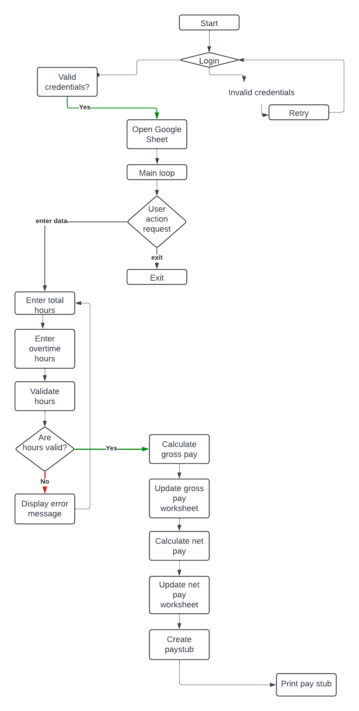

# Automated Employee Payroll

[Here is the live website link!](https://employee-payroll-e73ff1f1c097.herokuapp.com/)

[Here is the link to the live GoogleSheet](https://docs.google.com/spreadsheets/d/1YnG2qfR0p6KZsm26ygfB5IRJA8U38uFi2xsBnKnsvrE/edit?usp=sharing)

# Login details

Username : user

Password : password

# Table of Contents

- [Purpose](#Purpose)
- [Goal](#Goal)
- [UX Design](#UX-Design)
- [FlowChart](#FlowChart)
- [Colorama](#Colorama)
- [Python Logic](#Python-logic)
- [APIs used](#APIs-used)
- [Testing](#Testing)
- [Technologies used](#Technologies-used)

# Purpose

The Employee Payroll App is a comprehensive solution designed to streamline and simplify the payroll process for a small business owner with 5 employees currently.The owner does payroll themself, by entering entering total and overtime hours weekly to create pay stubs for al employees. At the moment since all employees are earning close to minimum wage, there's only 1 deduction; a 20% tax rate. The app ensures accurate and timely payroll processing, reduces administrative workload, and enhances compliance with labor laws and regulations. With user-friendly interfaces and robust functionality, the Employee Payroll App is an essential tool for modern workforce management.

# Goal

The goal of the app is to allow the business owner to create weekly pay stubs for their 5 employees.

# UX Design

## Target audience

Small business owner with only employees earning close to minimum wage at a tax rate of 20%

## User stories

### As a first time user

- I want to enter my username and password for authentication so that a user without the login details cannot access payroll information.
- I want to enter total hours for my employees.
- I want to enter overtime hours for my employees.
- I want instructions for entering data to be easy to understand.
- I want total hours and overtime hours to be updated to a spreadsheet.
I want gross pay to be calculated.
- I want net pay to be calculated by deducting the 20% tax rate.
- I want to create pay stubs for all my employees.

### As a returning user

- I want to be able to add more employees if I hire additional ones.
- I want to be able to calculate net pay for employees in a different tax bracket.
- I want to create pay stubs for all my employees

# Design

## FlowChart

1. **Validate user:**
- Input username and password.
- Validate against stored credentials.
2. **Input total hours:**
- Input total hours for all employees.
3. **Update total hours worksheet:**
- Insert total hours into GoogleSheet.
4. **Input overtime hours:**
- Input overtime hours for all employees.
5. **Update overtime hours worksheet:**
- Insert overtime hours into GoogleSheet.
6. **Calculate gross pay:**
- Calculate each employee's gross pay.
7. **Update gross pay worksheet**
- Update GoogleSheet with calculated gross pay far all employees.
8. **Calculate net pay:**
- Calculate each employee's net pay.
9. **Update net pay worksheet:**
Update GoogleSheet with calculated net pay far all employees.
10. **Create pay stubs:**
-Generate and display pay stubs for all employees

## Colorama

The application uses the colorama library for changing the color of terminal text to enhance user experience with clear visual feedback:

1. Green for valid data messages.

2. Red for invalid data messages.

# Application Features

## Python logic
- User Validation: Ensures secure login for administrators.
- Grade Input: Collects grades for Mathematics, English, Physics and Chemestry.
- Data Insertion: Adds grades to Google Sheets.
- Grade Collection: Retrieves and displays all stored grades.
- Averages Calculation: Calculates the average grade for each student subject.
- Averages Update: Updates Google Sheets with grade average data.
- Student Ranking: Ranks students based on average grades ascending.
- Report Card Generation: Produces report cards with personalized comments.

## APIs used
- Google Sheets API: For storing, retrieving, and updating grade data.

## Technologies:

The app is developed using Python.

## Future Features

- Give the admin an option to add/ remove an employee
- Calculate a tax deduction of 40% for employees earning over $40, 000 a year.
- Have a separate input for holiday hours.

# Testing

**No Errors Where Found**

[CI Python Linter](https://pep8ci.herokuapp.com/#)

## Technologies used

- GitHub to store the source code.
- Gitpod chosen IDE to develop the website.
- Microsoft Word to create testing tables.
- Code Institute's Gitpod Template to generate the workspace for the project.
- Code institute learnings for general guidance.
- Techsini to create mockup of website on different iOS devices.

